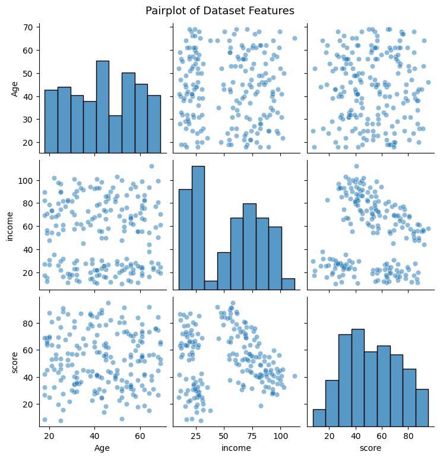
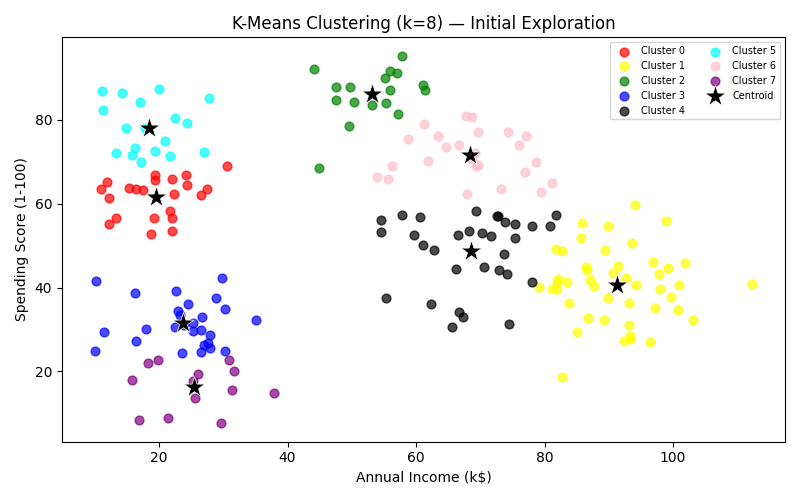
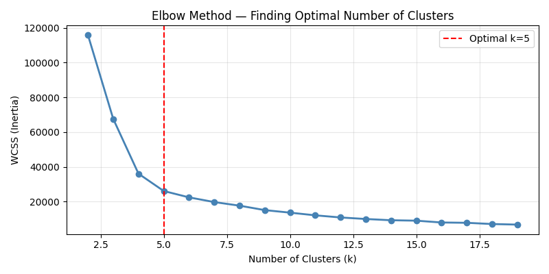
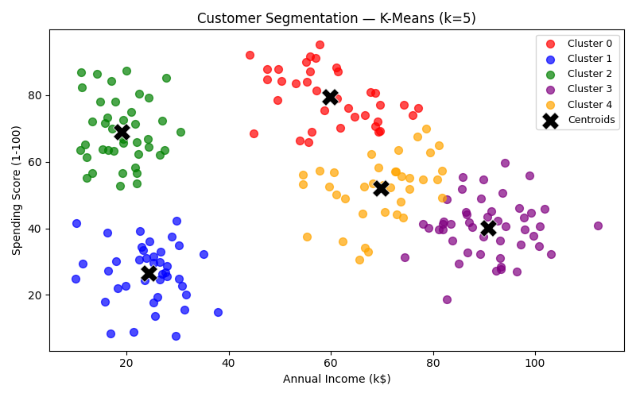
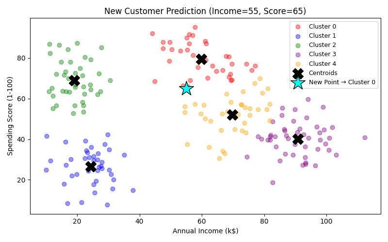

# 🛍️ K-Means Clustering — Mall Customer Segmentation

A complete walkthrough of unsupervised machine learning using **K-Means Clustering** on the Mall Customers dataset. The goal is to segment customers into distinct groups based on their **Annual Income** and **Spending Score**, and then predict which group a new customer belongs to.

---

## 📋 Table of Contents

1. [Dataset Overview](#1-dataset-overview)
2. [Libraries Used](#2-libraries-used)
3. [Exploratory Data Analysis — Pairplot](#3-exploratory-data-analysis--pairplot)
4. [Initial Model — K-Means with k=8](#4-initial-model--k-means-with-k8)
5. [Elbow Method — Finding Optimal k](#5-elbow-method--finding-optimal-k)
6. [Final Model — K-Means with k=5](#6-final-model--k-means-with-k5)
7. [New Data Point Prediction](#7-new-data-point-prediction)
8. [Assignment Summary](#8-assignment-summary)

---

## 1. Dataset Overview

The dataset used is the **Mall Customers Dataset**, which contains the following columns:

| Column | Description |
|--------|-------------|
| `CustomerID` | Unique ID for each customer |
| `Genre` | Gender of the customer |
| `Age` | Age of the customer |
| `Annual Income (k$)` → renamed to `income` | Annual income in thousands of dollars |
| `Spending Score (1-100)` → renamed to `score` | A score from 1–100 assigned by the mall based on spending behavior |

The two key columns used for clustering are **`income`** and **`score`**.

> Column renaming was done early for convenience:
> ```python
> df = df.rename(columns={"Annual Income (k$)": "income", "Spending Score (1-100)": "score"})
> ```

---

## 2. Libraries Used

```python
import pandas as pd               # Data manipulation
import seaborn as sns             # Statistical visualizations
import matplotlib.pyplot as plt   # Plotting
from sklearn.cluster import KMeans  # K-Means algorithm
from kneed import KneeLocator       # Automatic elbow detection
```

---

## 3. Exploratory Data Analysis — Pairplot

Before building any model, a **pairplot** was generated to visualize relationships between all numerical features (`Age`, `income`, `score`). This helps identify any natural groupings or correlations in the data.

```python
sns.pairplot(df)
```



> **Key observation:** The `income` vs `score` scatter shows visible natural clusters — customers tend to group into distinct segments, making this a great candidate for K-Means.

---

## 4. Initial Model — K-Means with k=8

A K-Means model was first trained with the **default number of clusters (k=8)** to get an initial feel for the data segmentation. The model was fit on the `income` and `score` columns.

```python
kmeans = KMeans()
model = kmeans.fit(df[["income", "score"]])
pred = model.predict(df[["income", "score"]])
cluster = model.cluster_centers_
df["pred"] = pred
```

Eight separate DataFrames were created (one per cluster) and all were plotted together with their centroids:

```python
sns.scatterplot(x=df0["income"], y=df0["score"], label="cluster0", color="red")
# ... (repeated for df1 through df7)
sns.scatterplot(x=cluster[:,0], y=cluster[:,1], marker="*", s=200, label="centroid")
```



> **Note:** With k=8, some clusters appear overly split. The Elbow Method is used next to determine the optimal number of clusters.

---

## 5. Elbow Method — Finding Optimal k

The **Elbow Method** computes the **Within-Cluster Sum of Squares (WCSS / Inertia)** for different values of k (from 2 to 19). As k increases, WCSS decreases — but the rate slows down. The "elbow" is where adding more clusters stops giving meaningful improvement.

```python
wcss = []
cluster_num = range(2, 20)
for k in cluster_num:
    new_model = KMeans(n_clusters=k)
    model2 = new_model.fit(df[["income", "score"]])
    wcss.append(model2.inertia_)

plt.plot(cluster_num, wcss, marker="o")
```

The **`kneed`** library was used to automatically locate the exact elbow point:

```python
from kneed import KneeLocator
knl = KneeLocator(cluster_num, wcss, curve="convex", direction="decreasing")
knl.plot_knee()
```



> **Result:** The elbow is found at **k = 5**, meaning 5 clusters is the optimal number. WCSS drops steeply before k=5 and flattens significantly afterward.

---

## 6. Final Model — K-Means with k=5

With the optimal **k=5** confirmed, a new model was trained with `random_state=42` for reproducibility.

```python
new_kmean = KMeans(n_clusters=5, random_state=42)
new_model = new_kmean.fit(df[["income", "score"]])
new_centroids = new_model.cluster_centers_
print("Centroids\n(Income, Score):\n", new_centroids)
```

The old `pred` column was dropped and replaced with a cleaner `cluster` column:

```python
df = df.drop(columns='pred', axis=1)
df["cluster"] = new_model.predict(df[["income", "score"]])
```

Five DataFrames were created (df0–df4) and visualized:

```python
plt.figure(figsize=(7, 4))
sns.scatterplot(x=df0["income"], y=df0["score"], label="Cluster 0", color="red")
# ... (Cluster 1 through 4)
plt.scatter(new_centroids[:, 0], new_centroids[:, 1], color="black", marker="X", s=200, label="Centroids")
plt.title("Customer Segmentation (k=5)")
plt.xlabel("Annual Income")
plt.ylabel("Spending Score")
plt.legend()
plt.show()
```



### 🔍 Cluster Interpretation

| Cluster | Income | Spending Score | Customer Type |
|---------|--------|----------------|---------------|
| 0 | Low | High | Impulsive / Overspenders |
| 1 | High | High | Target Customers (ideal segment) |
| 2 | High | Low | Careful / Conservative spenders |
| 3 | Low | Low | Budget-conscious customers |
| 4 | Mid | Mid | Average / Standard customers |

---

## 7. New Data Point Prediction

The notebook accepts user input for a new customer's **Annual Income** and **Spending Score**, predicts their cluster, and visualizes the result.

```python
new_income = float(input("Enter the new Annual Income (k$): "))
new_score  = float(input("Enter the new Spending Score (1-100): "))

new_data = pd.DataFrame([[new_income, new_score]], columns=["income", "score"])
predicted_cluster = new_model.predict(new_data)[0]

print(f"The model predicts this new customer belongs to Cluster: {predicted_cluster}")
```

The new point is added to the scatter plot with a distinct **cyan star marker**:

```python
plt.scatter(new_income, new_score, color="cyan", marker="*", s=400,
            edgecolor="black", label=f"Cluster{predicted_cluster}")
```



> **In this example:** A customer with Income = 55 and Score = 65 is shown as a cyan star. The model clearly places it within one of the 5 clusters.

---

## 8. Assignment Summary

The notebook includes a structured **assignment** that reinforces the concepts:

| Part | Task |
|------|------|
| **Part 1** | Train K-Means with k=5, find centroids, update dataset, create 5 DataFrames, visualize |
| **Part 2** | Accept user input (income & score), predict cluster, visualize the new point on the scatter plot |

All assignment tasks were completed in the latter half of the notebook.

---

## ⚙️ How to Run

1. **Install dependencies:**
   ```bash
   pip install pandas seaborn matplotlib scikit-learn kneed
   ```

2. **Load the dataset** (`mall customers.csv`) from Kaggle or any compatible source.

3. **Run cells sequentially** in Jupyter Notebook / Kaggle Notebook.

4. When prompted, enter the new customer's **Annual Income** and **Spending Score**.

---

## 📁 File Structure

```
kmeans-clustering.ipynb   ← Main notebook
README.md                 ← This file
images/
  ├── pairplot.png        ← Pairplot of dataset features
  ├── kmeans8.png         ← Initial clustering with k=8
  ├── elbow.png           ← Elbow method chart
  ├── kmeans5.png         ← Final clustering with k=5
  └── newpoint.png        ← New customer prediction plot
```

---

*Built with Python · scikit-learn · seaborn · matplotlib · kneed*
